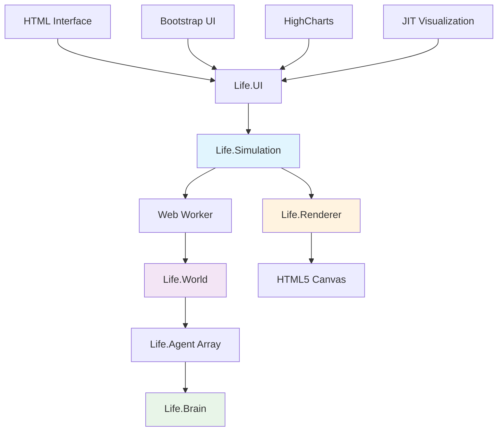
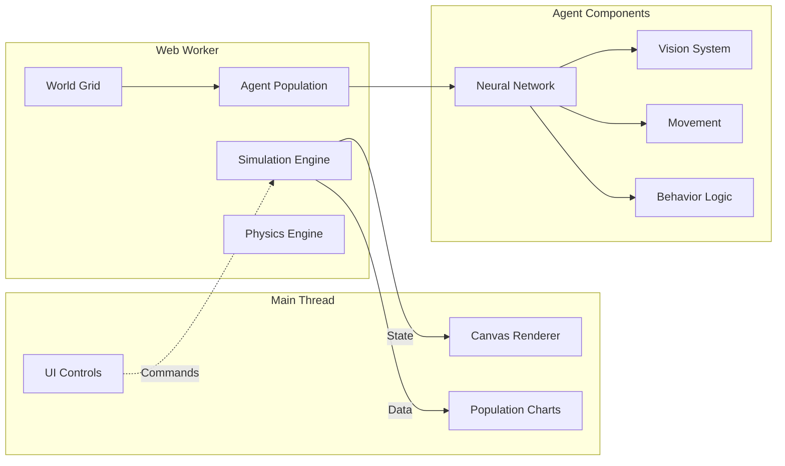
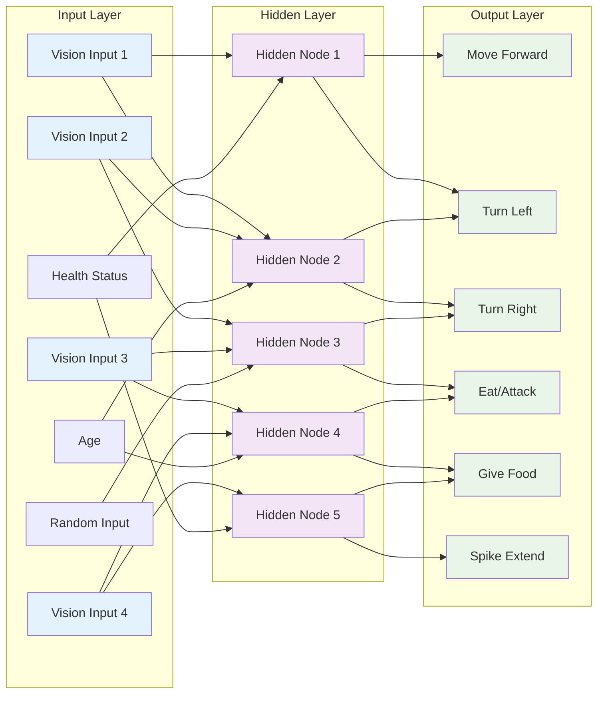
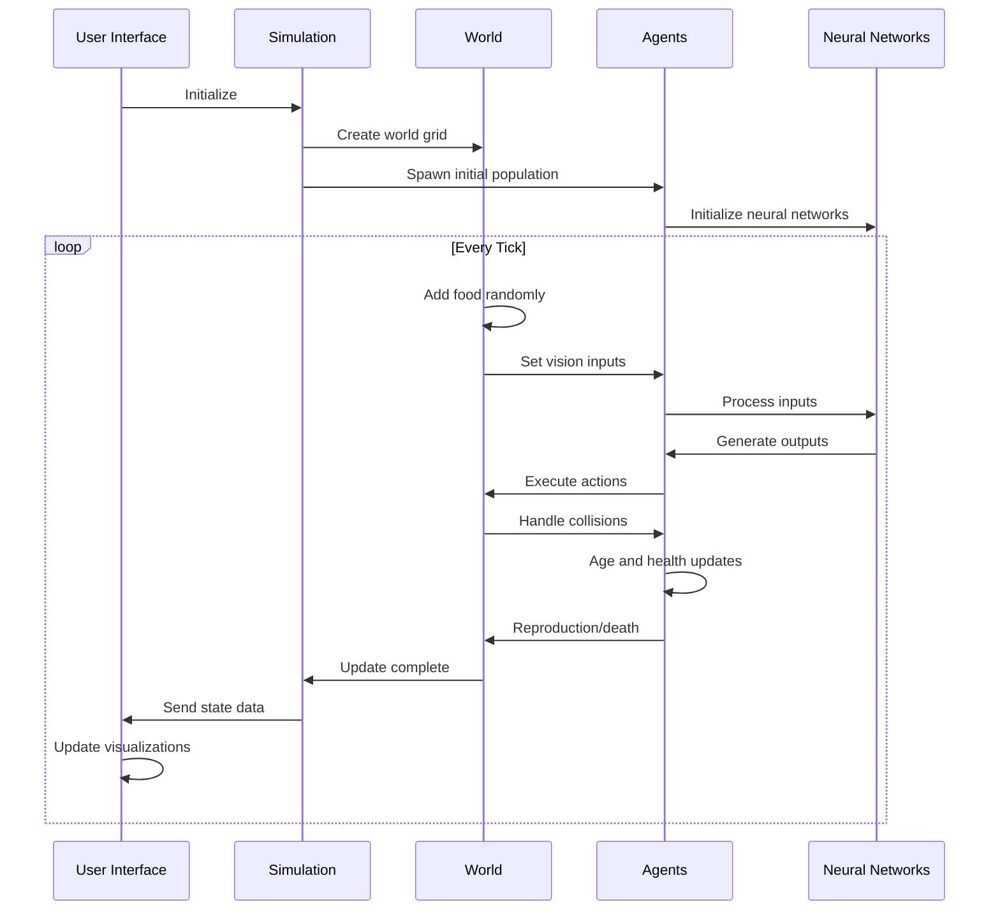
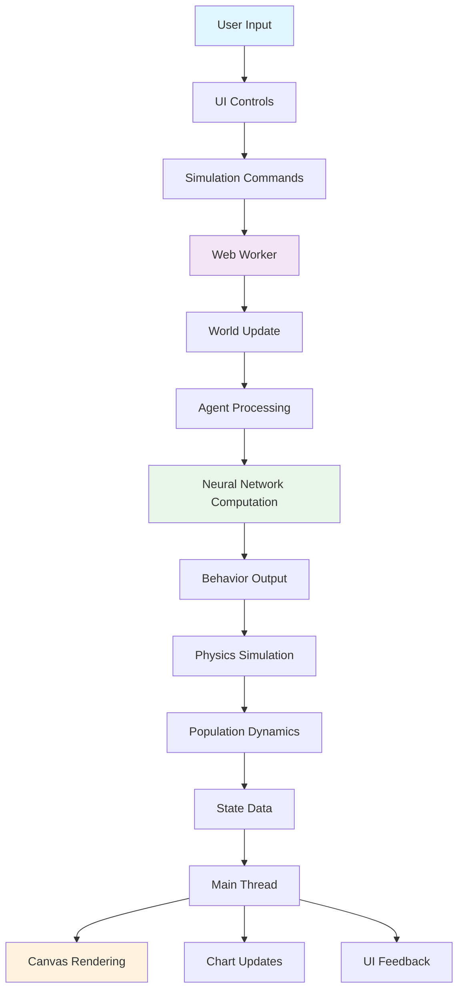

# Life.js - Artificial Life Simulation

A JavaScript port of [Scriptbots](https://sites.google.com/site/scriptbotsevo/), featuring evolving neural network agents in a dynamic ecosystem. Watch as artificial organisms compete, reproduce, and evolve complex behaviors through natural selection.


## 🌟 Features

- **Artificial Life Simulation**: Watch autonomous agents evolve and adapt
- **Neural Network Brains**: Each agent has an evolving neural network
- **Dynamic Ecosystem**: Herbivores, carnivores, and vegetation interact
- **Real-time Evolution**: Observe natural selection in action
- **Interactive Controls**: Pause, clone, kill agents, and adjust parameters
- **Visual Analytics**: Population charts and brain visualization
- **Web-based**: Runs in any modern browser

## 🏗️ Architecture Overview



## 🔄 System Components

### Core Architecture



### Component Details

#### 🧠 Life.Simulation
- **Purpose**: Main simulation controller and interface
- **Responsibilities**: Manages world state, agent lifecycle, parameter configuration
- **Key Methods**: `init()`, `sendCommand()`, `update()`

#### 🌍 Life.World  
- **Purpose**: Simulation environment and physics
- **Features**: Toroidal grid system, food distribution, collision detection
- **Data**: Agent positions, food cells, environmental parameters

#### 🤖 Life.Agent
- **Purpose**: Individual organisms with neural network brains
- **Capabilities**: Vision, movement, eating, reproduction, combat
- **Evolution**: Genetic mutation of neural network weights

#### 🎨 Life.Renderer
- **Purpose**: Visual representation of the simulation
- **Features**: Real-time canvas rendering, agent visualization, environmental display
- **Performance**: Optimized for smooth 60fps rendering

#### 🎛️ Life.UI
- **Purpose**: User interface and interaction controls
- **Features**: Parameter adjustment, agent inspection, data visualization
- **Integration**: Bootstrap components, charts, brain graphs

## 🧬 Agent Neural Network Architecture



## 🔄 Simulation Lifecycle



## 🚀 Quick Start

### Installation

1. Clone the repository:
```bash
git clone https://github.com/HyperCogWizard/lifejs.git
cd lifejs
```

2. Serve the files (required for Web Workers):
```bash
# Using Python
python3 -m http.server 8000

# Using Node.js (if you have http-server)
npx http-server

# Or any other static file server
```

3. Open your browser to `http://localhost:8000`

### Basic Setup

```html
<!DOCTYPE HTML>
<html>
<head>
    <title>Life.js Simulation</title>
    <script type="text/javascript" src="Life.js"></script>
</head>
<body>
    <script type="text/javascript">
        var view = new Life.Renderer();
        view.init();
        document.body.appendChild(view.canvas);
    </script>
</body>
</html>
```

### Advanced Setup with UI

```html
<!DOCTYPE html>
<html>
<head>
    <script src="Life.js"></script>
    <script src="LifeUI.js"></script>
</head>
<body>
    <div id="simulation"></div>
    <script>
        var parameters = {
            width: 800,
            height: 600,
            maxAgents: 50,
            tickDuration: 20
        };
        
        var simulation = new Life.Simulation(parameters);
        var renderer = new Life.Renderer(simulation);
        var ui = new Life.UI(simulation);
        
        simulation.init();
        renderer.init();
        
        document.getElementById('simulation').appendChild(renderer.canvas);
    </script>
</body>
</html>
```

## ⚙️ Configuration

### Simulation Parameters

```javascript
var parameters = {
    // Timing
    tickDuration: 20,           // Milliseconds between updates
    
    // World
    width: 1200,                // World width in pixels
    height: 800,                // World height in pixels
    cellSize: 64,               // Food cell size
    
    // Population
    minAgents: 25,              // Minimum agent population
    maxAgents: 50,              // Maximum agent population
    
    // Environment
    maxFood: 0.5,               // Maximum food per cell
    foodAddFrequency: 30,       // Ticks between food spawning
    
    // Agent properties
    agent: {
        radius: 10,             // Agent size
        speed: 0.3,             // Base movement speed
        viewDistance: 150,      // Vision range
        numberEyes: 4,          // Number of vision inputs
        babies: 2,              // Offspring count
        mutationRate: [0.002, 0.05]  // Neural network mutation
    }
};
```

### Agent Behavior Tuning

```javascript
agent: {
    // Movement
    speed: 0.3,
    sprintMultiplier: 2,
    
    // Vision system
    numberEyes: 4,
    viewDistance: 150,
    
    // Combat
    spikeStrength: 1,
    spikeSpeed: 0.005,
    
    // Metabolism
    foodIntake: 0.002,
    foodWasted: 0.001,
    foodTraded: 0.001,
    
    // Evolution
    reproductionRate: {
        carnivore: 7,
        herbivore: 7
    },
    mutationRate: [0.002, 0.05]
}
```

## 📊 Data Flow



## 🎮 Interactive Controls

- **Pause/Resume**: Stop or continue the simulation
- **Clone Agent**: Duplicate the selected agent
- **Kill Agent**: Remove the selected agent
- **Advanced Controls**: Access detailed parameter tuning
- **Render Options**: Toggle visual elements (grass, health bars, vision cones)
- **Brain Visualization**: View neural network structure
- **Population Charts**: Track species over time

## 🧪 API Reference

### Life.Simulation

```javascript
// Constructor
var simulation = new Life.Simulation(parameters);

// Methods
simulation.init()                    // Initialize simulation
simulation.sendCommand(cmd, options) // Send control command
simulation.close()                   // Cleanup resources
```

### Life.Renderer

```javascript
// Constructor  
var renderer = new Life.Renderer(simulation, parameters);

// Methods
renderer.init()                      // Setup canvas
renderer.update()                    // Render frame
renderer.setRenderOptions(options)   // Configure display
```

### Life.Agent

```javascript
// Properties
agent.x, agent.y                    // Position
agent.health                        // Current health
agent.age                           // Agent age
agent.species                       // Herbivore/Carnivore
agent.brain                         // Neural network

// Methods
agent.update(world)                  // Process one tick
agent.reproduce(partner)             // Create offspring
agent.mutate()                       // Apply genetic mutations
```

## 🔬 Technical Details

### Neural Network Evolution

Each agent possesses a feed-forward neural network that controls its behavior. The network evolves through:

1. **Genetic Inheritance**: Offspring inherit parent neural networks
2. **Mutation**: Random weight modifications during reproduction  
3. **Selection Pressure**: Successful agents reproduce more frequently
4. **Crossover**: Future enhancement for genetic diversity

### Physics Engine

- **Collision Detection**: Spatial partitioning for performance
- **Toroidal World**: Wrap-around boundaries
- **Vision System**: Ray-casting for environmental perception
- **Movement**: Velocity-based with momentum

### Performance Optimizations

- **Web Workers**: Offload simulation to background thread
- **Spatial Partitioning**: Efficient collision detection
- **Culling**: Render only visible elements
- **Batch Processing**: Group similar operations

## 🎯 Use Cases

- **Educational**: Demonstrate evolutionary principles
- **Research**: Study emergent behaviors and evolution
- **Entertainment**: Watch artificial life unfold
- **Development**: Base for more complex simulations

## 🛠️ Troubleshooting

### Common Issues

**Simulation not starting:**
- Ensure you're serving files via HTTP/HTTPS (not file://)
- Check browser console for Web Worker errors
- Verify all JavaScript files are loading correctly

**Poor performance:**
- Reduce `maxAgents` parameter
- Increase `tickDuration` for slower updates
- Disable visual elements like grass rendering

**Neural network visualization not showing:**
- Click "Update Brain Graph" button
- Select an agent by clicking on it
- Switch to the "Selected Agent" tab

### Browser Compatibility

- **Modern browsers**: Chrome 80+, Firefox 75+, Safari 14+, Edge 80+
- **Required features**: HTML5 Canvas, Web Workers, ES5+
- **Recommended**: Hardware acceleration enabled

## 🎯 Use Cases

- **Educational**: Demonstrate evolutionary principles
- **Research**: Study emergent behaviors and evolution
- **Entertainment**: Watch artificial life unfold
- **Development**: Base for more complex simulations

## 🔗 Links

- **Original Scriptbots**: https://sites.google.com/site/scriptbotsevo/
- **Default Parameters**: https://github.com/JimAllanson/lifejs/wiki/Default-Parameters
- **Live Demo**: http://jimallanson.github.com/lifejs/

## 📄 License

Open source - see individual file headers for specific licensing information.

---

*Life.js brings the fascinating world of artificial life to your browser. Watch evolution in action!*
